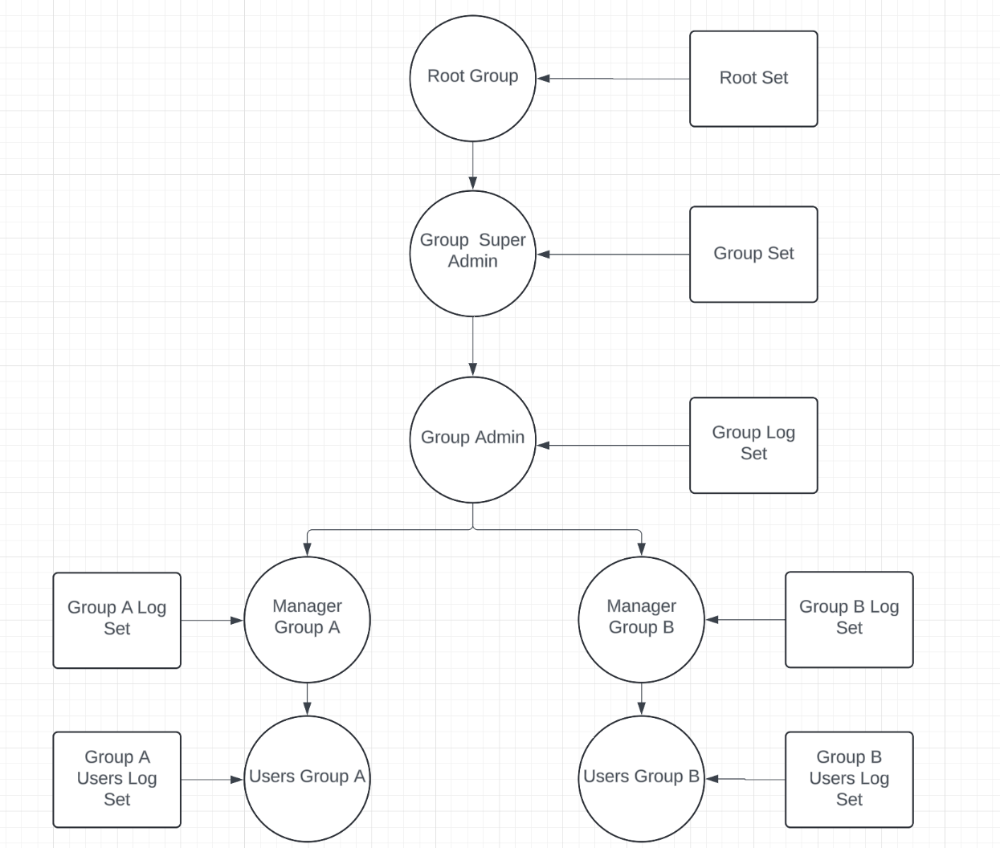
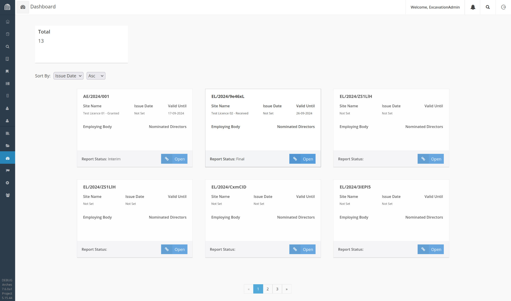

## Arches ORM

### Recap

* Webdevs are used to Object Relational Mappers
* Easier to read, write and maintain logic in a project
* Resource models appear as dynamically-generated classes
* _Can assume a model has not changed since process restart_


### What has happened since Los Angeles?

* Permissions auto-integrated to the ORM
* The ORM can run from a real (Django) database
* Or static JSON [partial]
* Or via standard Arches APIs [partial]
* And mostly the code can be reused (even as a library) between frontend/backend/notebooks


* **View models** give native-feeling wrappers for semantic nodes, concepts, etc.
* Does not unnecessarily create Tiles
* PoC-level bulk insertion
* Got spatialite working for Arches tests (not proper use)


```python
import arches_orm.arches_django
from arches_orm.models import Person

st_col = Person()
st_col_name = st_col.names.append()
st_col.full_name = "Saint Columba"
st_col_name = st_col.names.append()
st_col.full_name = "Colum Mór"
st_col.save()
```


```python
columbas: list[Person] = Person.where(full_name="Saint Columba") # PG
greats: list[Person] = Person.search("Mór") # ES
```


```python
address = Address()
address.first_line = "The Abbey"
address.second_line = "Iona"
address.city = "Argyll"
ash.addresses.append(address)


#### Gory Technical Details


* We abstract out Arches/Django so this library could work client-side
* It can use multiple backends simultaneously, perhaps to write loaders or syncing
* View models for new types can be added easily (e.g. User)


### Future

* Archeslite: tiny, Arches-compatible microsites
* NoArches: rendering static websites (e.g. Github Pages)
* JS &amp; Offline functionality (Owen)
* Cleanly-separated Arches-to-Arches syncing
* Exporters
* Powerful backend business logic in Arches projects


# Permissions


### What have we implemented?





### How do we do this?

```python
# Create a new person and activity
admin = Person()
ash = admin.name.append()
ash.full_name = "Ash"
admin.user_account = self.user
admin.save()

activity = Activity.create()
activity.save()
```


```python
# We put the resource (an Activity) in the Root Set.
st = Set.find(GROUPINGS["permissions"]["root_group"])
st.members.append(activity)
st.save()
```


```python
# Give them nodegroup premissions
framework.assign_perm("view_resourceinstance", self.group, resource)
framework.recalculate_table()
```


```python
# We put the resource (an Activity) in the Root Set.
st = Set.find(GROUPINGS["permissions"]["root_group"])
st.members.append(activity)
st.save()
```


```python
# We add the Person to the Root Group.
gp = ArchesGroup.find(GROUPINGS["groups"]["root_group"])
gp.members.append(admin)
gp.save()
```


```python
# We give the Root Set permissions (RW) to the Root Set member tree.
permission = gp.permissions.append()
permission.object = st
PermissionType = permission.action.__collection__
permission.action.append(PermissionType.Reading)
permission.action.append(PermissionType.Writing)
gp.save()
```


```python
# We create a nested set under the original set and a second activity.
subset = Set.create()
subactivity = Activity.create()
subset.members.append(subactivity)
subactivity.save()
# Append the subset to our root set
st.nested_sets.append(subset)
subset.save()
st.save()
```


```python
# If this set is not nested under the Root Set, the user does not yet
# have any permissions to its members.
st.nested_sets.append(subset)
subset.save()
st.save()
_sync_es()
```


```python
# Add a subgroup
sg = ArchesGroup.create()
team_member = Person.create()
team_member.user_account = User.objects.get(username="jim")
team_member.save()
sg.members.append(team_member)
sg.save()
gp.members.append(sg)
gp.save()
```


```python
# We give the Root Set permissions (RW) to the subgroup member tree.
permission = sg.permissions.append()
st = Set.find(GROUPINGS["permissions"]["root_group"])
permission.object = st
PermissionType = permission.action.__collection__
permission.action.append(PermissionType.Reading)
permission.action.append(PermissionType.Writing)
sg.save()
```

Gives access for both the users to both the activities in both sets


```python
 # Add a permission to the subset.
permission = sg.permissions.append()

subset = Set.find(subset.id)
permission.object = subset
PermissionType = permission.action.__collection__
permission.action.append(PermissionType.Reading)
permission.action.append(PermissionType.Writing)
sg.save()
```

this only gives access to the subset activity for the user in the subset group


### What is the future?


# Dashboards


### What is the point of dashboards?





### How do we do this?


```python
from arches_orm.models import Person
  user_id = request.user.id                     
  person_resource = Person.where(user_account = user_id)
  task_resources = []
  user_group_ids = self.get_groups(person_resource[0].id)
  strategies = set()
  for groupId in user_group_ids:
      strategy = self.select_strategy(groupId)
      strategies.add(self.select_strategy(groupId))
  for strategy in strategies:
      resources, counters, sort_options = strategy.get_tasks(
        groupId, 
        person_resource[0].id
      )
      task_resources.extend(resources)
```


```python
def get_groups(self, userId):
        from arches_orm.models import Group

        groups = Group.all()

        userGroupIds = []

        for group in groups:
            for member in group.members:
                if member.id == userId:
                    userGroupIds.append(group.id)
```


```python
consultations = Consultation.all()

planning_consultations=[c for c in consultations if c._._name.startswith('CON/')]

#checks against type & status and assigns to user if in correct group
for consultation in planning_consultations:
  action_status = consultation.action[0].action_status
  action_type = consultation.action[0].action_type
  assigned_to_list = consultation.action[0].assigned_to_n1
  reassigned_to_list = consultation.assignment[0].re_assignee.re_assigned_to
```


### Building the Data

```python
action_status = consultation.action[0].action_status
date_entered = consultation.consultation_dates.log_date
deadline = consultation.action[0].action_dates.target_date_n1
hierarchy_type = consultation.hierarchy_type
address = consultation.location_data.addresses

address = [
  address.street.street_value, 
  address.town_or_city.town_or_city_value, 
  address.postcode.postcode_value
]

if date_entered:
    date_entered = datetime.strptime(
      date_entered, "%Y-%m-%dT%H:%M:%S.%f%z"
    ).strftime(
      "%d-%m-%Y"
    )
```       


```python
resource_data = {
    'id': consultation.id,
    'tasktype': 'Planning',
    'displayname': consultation._._name,
    'displaydescription': consultation._._description,
    'status': action_status,
    'hierarchy_type': hierarchy_type,
    'date': date_entered,
    'deadline': deadline,
    'deadlinemessage': deadline_message,
    'address': address,
    'responseslug': responseslug
}
return resource_data
```


### Could we do this in configuration?

[some people have asked why we don't make configuration files to do this rather than have Python code]


### What is the future?

* Flexibility with the card component to handle a range of data
* Pull more visual information through such as maps
* Create custom dashboards through safe search
